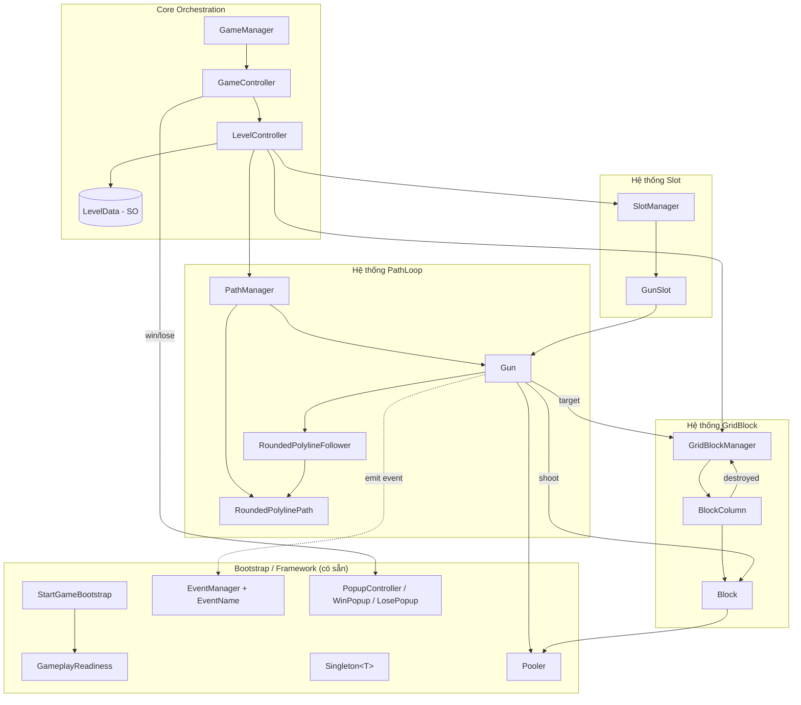
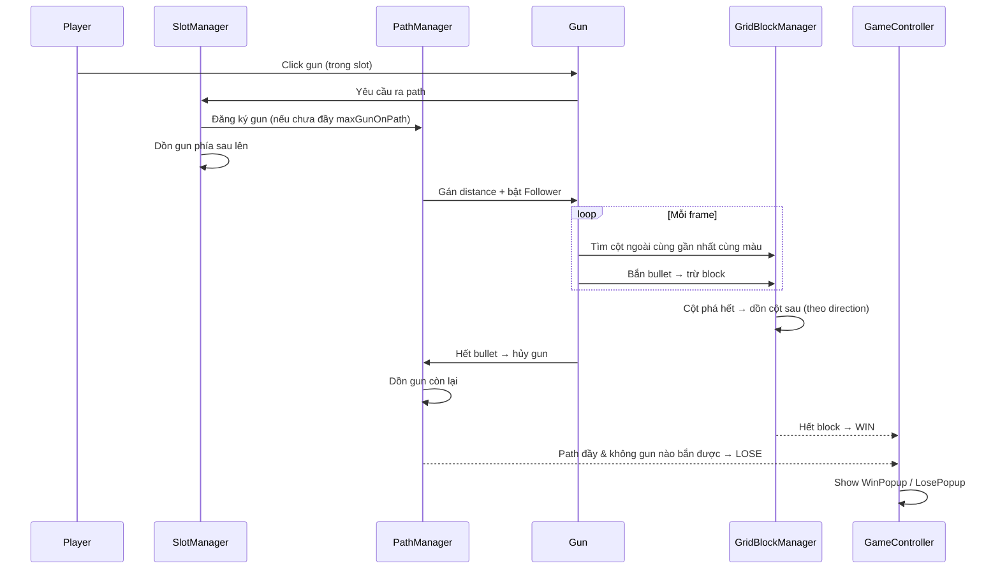

# PixelShoot — Kiến trúc Script & Core Logic

> Tài liệu mô tả mối liên kết giữa các script trong dự án **PixelShoot** và core logic gameplay.
> Namespace chuẩn cho **toàn bộ** script gameplay: **`Wayfu.Lamkn`** (xem [Quy ước](#0-quy-ước--convention)).
>
> Dự án tham chiếu `D:\Unity\PixelShoot_2` (bản Voodoo decompile: `Hole`/`SuperHole`/`BlockCell`…) chỉ dùng để **tham khảo cách đặt tên & data**, không copy trực tiếp.

---

## 0. Quy ước — Convention

| Quy ước | Nội dung |
|---|---|
| Namespace | Mọi script gameplay đặt trong `Wayfu.Lamkn`. |
| Framework có sẵn | `Singleton<T>`, `EventManager` + `EventName`, `Pooler`, `PopupSystem`, `GameManager/GameController/LevelController` (đang là skeleton rỗng). |
| Giao tiếp | Ưu tiên gọi trực tiếp qua `Singleton.Instance`; dùng `EventManager` cho sự kiện UI/global (win/lose/score). |
| Data | Dùng `ScriptableObject` cho `LevelData` (thiết kế level), class `[Serializable]` cho data con (gun/block/column). |

### ⚠️ Cần chuẩn hoá namespace (action items)
| File | Hiện tại | Cần sửa thành |
|---|---|---|
| [RoundedPolylinePath.cs](../Assets/Scritps/RoundedPolylinePath.cs) | *không có namespace* | `Wayfu.Lamkn` |
| [RoundedPolylineFollower.cs](../Assets/Scritps/RoundedPolylineFollower.cs) | *không có namespace* | `Wayfu.Lamkn` |
| [StartGameBootstrap.cs](../Assets/GameAsset/Scripts/StartGameBootstrap.cs) | `BusSort.Gameplay` | `Wayfu.Lamkn` |
| [GameplayReadiness.cs](../Assets/GameAsset/Scripts/GameplayReadiness.cs) | `BusGame.Gameplay` | `Wayfu.Lamkn` |

> Lưu ý: thư mục hiện đặt tên `Assets/Scritps` (sai chính tả "Scripts"). Nên đổi thành `Assets/Scripts` để nhất quán.

---

## 1. Core Gameplay Loop

```
Click Gun (trong Slot)
      │
      ▼
SlotManager phát 1 gun ra path ──► PathManager đặt gun lên path (loop)
      │                                   │
      │   (gun trong slot phía sau        │  gun chạy theo RoundedPolylinePath
      │    dồn lên lấp chỗ trống)          │  bằng RoundedPolylineFollower
      ▼                                   ▼
                          Gun tìm CỘT ngoài cùng gần nhất CÙNG MÀU
                                          │
                                          ▼
                          Bắn bullet ──► phá Block trên cột
                                          │
                           ┌──────────────┴───────────────┐
                           ▼                              ▼
              Cột bị phá HẾT → GridBlockManager     Gun hết bullet → biến mất
              dồn cột phía sau lên (theo hướng)      → PathManager dồn gun còn lại
                           │
                           ▼
        WIN: phá hết Block  |  LOSE: path đầy gun (max) & không gun nào bắn được
```

**Điều kiện thắng/thua**
- **WIN**: mọi `Block` trên map bị phá huỷ.
- **LOSE**: path đã đầy tối đa gun (`maxGunOnPath`) **và** không gun nào còn có thể bắn được block nào (không còn cột cùng màu với bất kỳ gun nào trên path / trên slot).

---

## 2. Bản đồ liên kết Script (tổng quan)



---

## 3. Các hệ thống & Data (thiết kế)

> Các script dưới đây **chưa tồn tại**, là thiết kế đề xuất để hiện thực gameplay. File đã có được đánh dấu ✅.

### 3.1 Màu dùng chung
| Type | Vai trò |
|---|---|
| `enum BlockColor` | Màu dùng chung cho Gun và Block (Red/Green/Blue…). Gun chỉ bắn được block cùng `BlockColor`. |

### 3.2 Hệ thống PathLoop (yêu cầu #4)
Đường đi của gun, **luôn là loop**, mỗi level custom được, tối đa `maxGunOnPath` gun.

| Script | Loại | Trách nhiệm | Liên kết |
|---|---|---|---|
| ✅ [RoundedPolylinePath](../Assets/Scritps/RoundedPolylinePath.cs) | MonoBehaviour | Sinh polyline bo góc từ waypoints, `GetPointAtDistance(d)`, `TotalLength`, `isClosed=true` (loop). | Dùng bởi `Follower`, `PathManager`. |
| ✅ [RoundedPolylineFollower](../Assets/Scritps/RoundedPolylineFollower.cs) | MonoBehaviour | Di chuyển 1 transform dọc path theo `moveSpeed` (m/s), auto xoay theo hướng. | Gắn trên `Gun`, đọc `RoundedPolylinePath`. |
| `PathManager` | Singleton | Quản lý danh sách gun đang trên path; đảm bảo tối đa `maxGunOnPath`; khi gun đầu rời path / bị huỷ → **dồn** các gun phía sau lên; cấp `distance` khởi điểm cho mỗi gun. | Gọi bởi `SlotManager`/`LevelController`; điều khiển `Gun` + đọc `RoundedPolylinePath`. |

**Cơ chế dồn gun**: `PathManager` giữ các gun theo thứ tự `currentDistance` trên path. Khi 1 gun biến mất (hết bullet), các gun phía sau tăng dần khoảng cách mục tiêu để lấp khoảng trống → giữ đội hình cách đều.

### 3.3 Hệ thống Slot (yêu cầu #6)
Quản lý số hàng gun mỗi level và thứ tự gun ra.

| Script | Loại | Trách nhiệm | Liên kết |
|---|---|---|---|
| `SlotManager` | Singleton | Quản lý các `GunSlot` (số hàng gun trong level); quyết định thứ tự gun được đẩy ra path khi player click; khi 1 gun ra → gun phía sau trong slot dồn lên. | Đọc `LevelData.Slots`; đẩy `Gun` sang `PathManager`. |
| `GunSlot` | MonoBehaviour | Một hàng/khe chứa hàng đợi các `Gun` theo thứ tự spawn. | Chứa `Gun`; thuộc `SlotManager`. |

### 3.4 Gun (yêu cầu #3, #7)
| Script | Loại | Trách nhiệm | Liên kết |
|---|---|---|---|
| `Gun` | MonoBehaviour | Nhận click → di chuyển lên path; tìm cột ngoài cùng gần nhất cùng màu; bắn bullet; hết bullet → biến mất. | Có `GunData`; dùng `RoundedPolylineFollower`; target `GridBlockManager`. |
| `GunData` | `[Serializable]` | `BlockColor Color`, `int CountBullet`. | Field của `Gun`, nằm trong `LevelData`. |
| `Bullet` (tuỳ chọn) | MonoBehaviour/Pooled | Đạn bay từ gun tới block (nếu cần hiệu ứng bay). | Sinh bởi `Gun` qua `Pooler`; trúng `Block`. |

**Chọn mục tiêu**: Gun quét các `BlockColumn` cùng màu, chọn cột có block **ngoài cùng** (gần path nhất) và **gần gun nhất** theo khoảng cách.

### 3.5 Hệ thống GridBlock (yêu cầu #5, #8, #9)
Nhiều cột; cột ngoài cùng gần path bị phá → cột phía sau move lên theo **hướng** của cột.

| Script | Loại | Trách nhiệm | Liên kết |
|---|---|---|---|
| `GridBlockManager` | Singleton | Quản lý toàn bộ `BlockColumn`; xử lý cột bị phá hết → dồn cột phía sau theo hướng; báo `GameController` khi hết block (WIN). | Chứa `BlockColumn`; đọc `LevelData.Columns`. |
| `BlockColumn` | MonoBehaviour | Một cột gồm nhiều `Block` **cùng màu, cách đều**; có `direction` (hướng dồn khi cột trước bị phá). | Chứa `Block`; thuộc `GridBlockManager`. |
| `Block` | MonoBehaviour | 1 block: bị bắn thì trừ máu/biến mất; báo cột khi bị phá. | Có `BlockData`; thuộc `BlockColumn`. |
| `BlockData` | `[Serializable]` | `Vector3 Pos` (hoặc offset), `int IndexInColumn`. | Field của `Block`. |
| `ColumnData` | `[Serializable]` | `BlockColor Color`, `Vector3 StartPos`, `Vector3 Direction`, `int BlockCount`, spacing. | Field của `BlockColumn`, nằm trong `LevelData`. |

> Tham chiếu data từ dự án PixelShoot_2: [BlockCellData.cs](../../PixelShoot_2/Assets/Scripts/Assembly-CSharp/BlockCellData.cs) (`CellPos`, `BlockCol`, `SpawnerDirectionAngleZ`, `SpawnerDepth`…) — dùng làm gợi ý cho `ColumnData`/`BlockData`, không bê nguyên.

### 3.6 Data Level (yêu cầu #4,#6,#7,#8,#9)
| Script | Loại | Trách nhiệm |
|---|---|---|
| `LevelData` | `ScriptableObject` | Chứa toàn bộ cấu hình 1 level: waypoints path (loop), `maxGunOnPath`, danh sách `Slots` (mỗi slot = list `GunData`), danh sách `Columns` (`ColumnData`). |
| `LevelController` ✅(skeleton) | Singleton | Đọc `LevelData` → build path, slot, grid; khởi tạo 3 manager con. |

---

## 4. Luồng runtime chi tiết (sequence)



---

## 5. Level Tool (yêu cầu #10)

Editor tool (đặt trong `Assets/.../Editor`, namespace `Wayfu.Lamkn`) để thiết kế `LevelData`:

| Chức năng | Mô tả | Tác động tới |
|---|---|---|
| Vẽ path | Đặt/kéo waypoints tạo path loop | `LevelData.Waypoints` → `RoundedPolylinePath` |
| Cấu hình slot | Số slot (hàng gun) trong màn | `LevelData.Slots` |
| Cấu hình gun | Số gun/slot, số bullet mỗi gun, màu gun | `GunData` |
| Đặt cột | Vị trí các cột trên map + **hướng dồn** khi cột trước bị phá | `ColumnData` |
| **Validate** | Kiểm tra **tổng số block mỗi màu == tổng số bullet mỗi màu** (đảm bảo giải được) | Cảnh báo trong Editor |

> Rule validate cốt lõi: `∑ bullet(color) == ∑ block(color)` cho **mỗi màu**. Nếu lệch → level không thể WIN sạch → báo lỗi.

---

## 6. Bảng tổng hợp trạng thái file

| File / Script | Trạng thái | Namespace |
|---|---|---|
| RoundedPolylinePath / RoundedPolylineFollower | ✅ Có (đã thêm namespace) | `Wayfu.Lamkn` |
| GameController / LevelController | ✅ Đã hiện thực | `Wayfu.Lamkn` |
| Singleton / EventManager / Pooler / PopupSystem | ✅ Có (framework) | `Wayfu.Lamkn` |
| PathManager | ✅ `Gameplay/Path/` | `Wayfu.Lamkn` |
| SlotManager / GunSlot | ✅ `Gameplay/Slot/` | `Wayfu.Lamkn` |
| Gun / GunData | ✅ `Gameplay/Gun/`, `Gameplay/Data/` | `Wayfu.Lamkn` |
| GridBlockManager / BlockLane / BlockColumn / Block | ✅ `Gameplay/Block/` | `Wayfu.Lamkn` |
| BlockData / ColumnData / LaneData / SlotData / LevelData(SO) | ✅ `Gameplay/Data/` | `Wayfu.Lamkn` |
| BlockColor (enum) / BlockColorPalette | ✅ `Gameplay/Data/GameplayTypes.cs` | `Wayfu.Lamkn` |
| GameplayFactory / LevelPreview | ✅ `Gameplay/Core/` | `Wayfu.Lamkn` |
| LevelDataEditor (Level Tool) | ✅ `Editor/` | `Wayfu.Lamkn` |

> **Kiến trúc block (per-cell, bám sát PixelShoot_2)**: block được mô tả bằng `BlockCellData` (per-cell) như schema gốc — mỗi cell có `CellPos`, `BlockCol` (nhóm cột), `SpawnerDepth` (0 = ngoài cùng), `BlockStackCt` (số block trong cell), `SpawnerDirectionAngleZ` (hướng). Runtime `GridBlockManager` gom cell theo `BlockCol` thành cột; `BlockCell` (thay cho `BlockColumn`/`BlockLane` cũ) là 1 stack co lại theo mỗi phát bắn; cell `SpawnerDepth` thấp nhất = front, gun chỉ bắn được front. `LevelData` còn chứa metadata (`CurGameDifficulty`, `HolesGridSize`, `HoleCapacity`, `NumberOfColors`, `MechanicNames`), `BoardProps` và `Obstacles`.

---

## 7. Thứ tự hiện thực đề xuất

1. `BlockColor` enum + `GunData` / `BlockData` / `ColumnData` (data thuần).
2. `LevelData` (ScriptableObject) gom cấu hình.
3. `Block` → `BlockColumn` → `GridBlockManager` (grid + collapse cột).
4. Chuẩn hoá namespace + wrap `Gun` quanh `RoundedPolylineFollower`; `PathManager` (loop + dồn gun).
5. `GunSlot` → `SlotManager` (hàng đợi gun + dồn slot).
6. Nối `LevelController` build 3 manager; `GameController` xử lý WIN/LOSE + Popup.
7. `LevelEditorTool` (vẽ path/slot/cột + validate màu).
